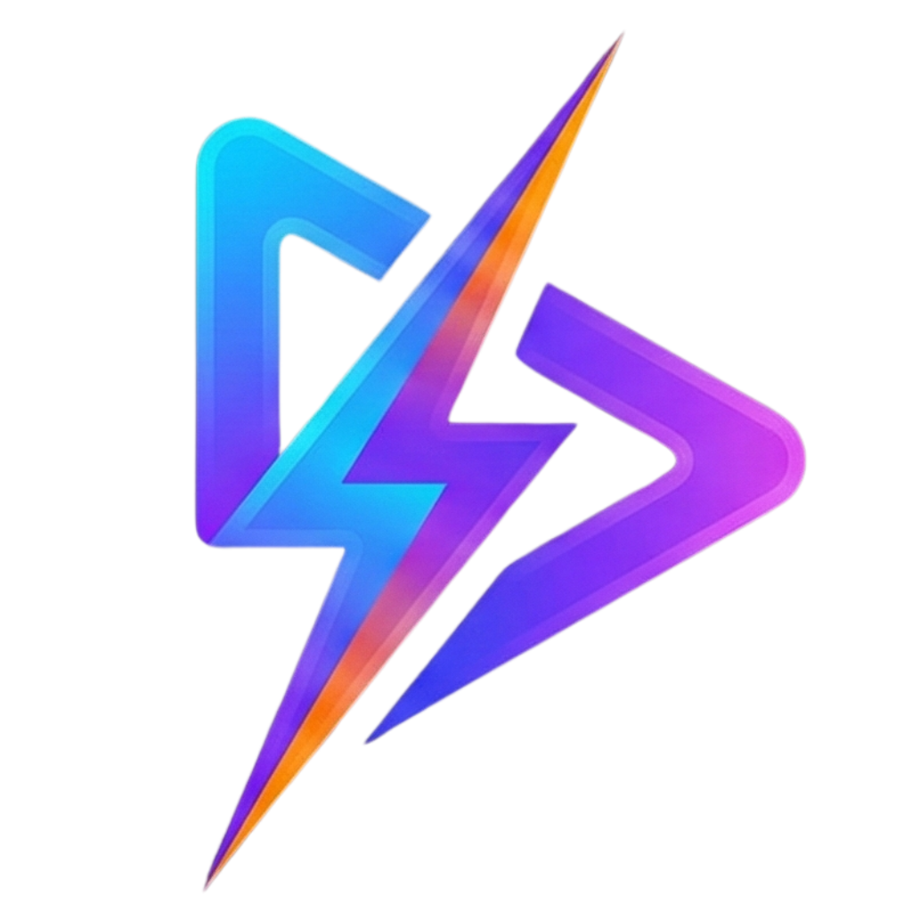
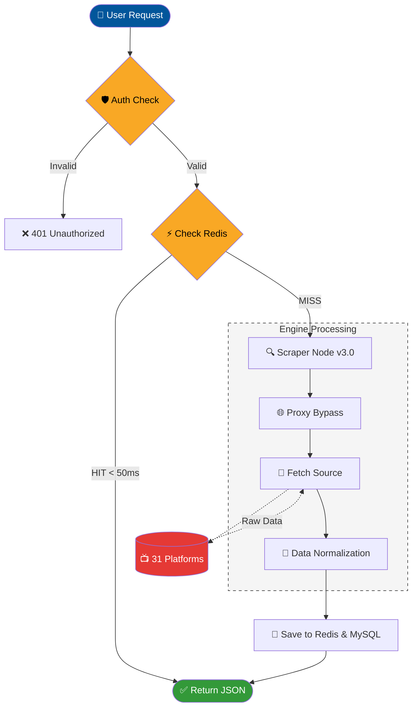
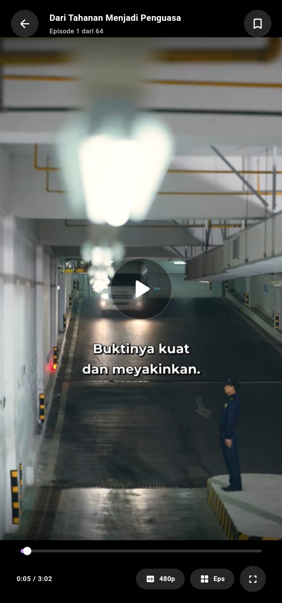
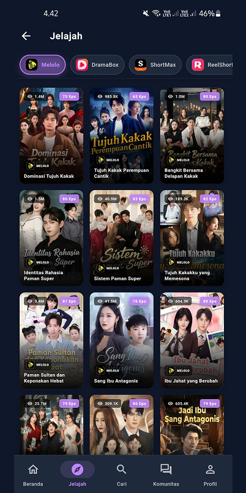
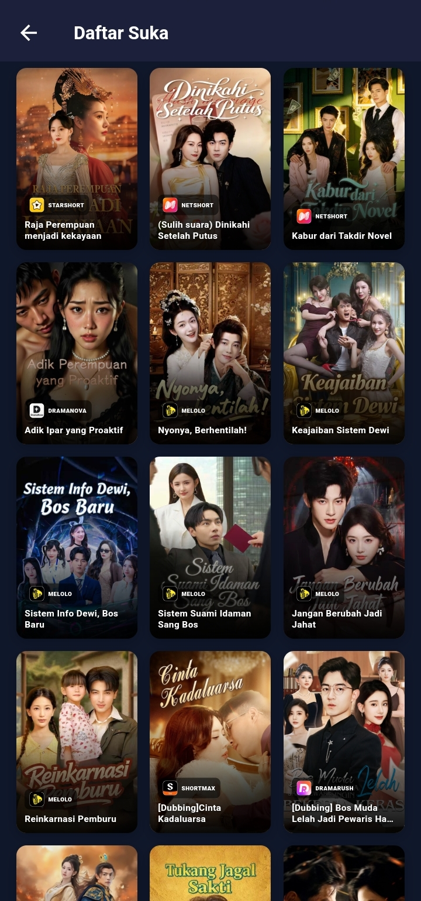
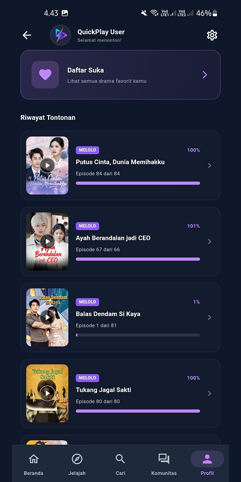

# QuickPlay - Modern Short Drama Streaming App (Multi Sub)

> **Aplikasi streaming drama China all-in-one dengan tampilan modern, performa cepat, dan 31 provider konten dari seluruh dunia.**

---

## 🔄 Cara Kerja Sistem

---

## ✨ Demo

| Platform     | Link                                             |
| ------------ | -----------------------------------------------  |
| Next.js Web  | [m.quickplay.my.id](https://m.quickplay.my.id)   |
| Flutter Web  | [quickplay.my.id](https://quickplay.my.id)       |
| Telegram Bot | [quickplaystrbot](https://t.me/quickplaystrbot)  |
| Api Drama    | [api-drama.dobda.id](https://api-drama.dobda.id) |

---

## 🌐 31 Provider Terintegrasi

|                                         Provider                                         |                                         Provider                                         |                                        Provider                                        |
| :--------------------------------------------------------------------------------------: | :--------------------------------------------------------------------------------------: | :------------------------------------------------------------------------------------: |
|      **Melolo**     |    **DramaBox**   |   **ShortMax**  |
|   **ReelShort**  |    **NetShort**   |  **MeloShort** |
|  **FlickReels** |   **FreeReels**  |  **DramaWave** |
|  **SnackShort** |    **FunDrama**   |  **StarShort** |
|      **FlexTV**     |   **DramaRush**  |    **RapidTV**   |
|   **Dramapops**  |   **GoodShort**  |    **Reelife**   |
|   **DramaNova**  |  **StardustTV** |  **DramaBite** |
|   **SodaReels**  |  **BiliTV** |  **iDrama** |
|  **PineDrama** |  **CubeTV** |  **Shortwave** |
|  **Reelala** |  **ShotShort** |  **MicroDrama** |
|  **RadReels** | | |

## 🌍 13 Supported Languages

|                  |               |                  |
| :--------------- | :------------ | :--------------- |
| 🇮🇩 **Indonesian** | 🇬🇧 **English** | 🇯🇵 **Japanese**   |
| 🇰🇷 **Korean**     | 🇹🇭 **Thai**    | 🇸🇦 **Arabic**     |
| 🇧🇷 **Portuguese** | 🇪🇸 **Spanish** | 🇻🇳 **Vietnamese** |
| 🇩🇪 **German**     | 🇫🇷 **French**  | 🇮🇹 **Italian**    |
| 🇹🇷 **Turkish**    |               |                  |

---

## 🚀 Fitur Unggulan

### Multi-Language Content
Mendukung **13 bahasa** dari seluruh dunia.

### Smart Video Player
- HLS (m3u8) & MP4 via `media_kit`
- Subtitle WebVTT (auto-convert SRT→WebVTT)
- Quality selection (240p, 360p, 480p, 540p, 720p, 1080p, auto)
- Persistent fit settings
- Auto-play next episode

> NOTE: Fitur download disediakan hanya untuk penggunaan pribadi (offline viewing) guna menghemat kuota. Pengguna dilarang keras menyebarluaskan kembali konten tersebut. QuickPlay tidak bertanggung jawab atas penyalahgunaan file hasil unduhan oleh pengguna.

### Progressive Search
Pencarian ke **semua provider secara paralel** — hasil muncul satu per satu.

### Watch History & My List
- Progress per-episode tersimpan lokal
- History dock di profil
- My List — bookmark favorit
- Swipe-to-delete

### UI Premium
- Material Design 3 + tema Light/Dark
- Skeleton loading via shimmer
- Banner carousel featured content
- Glassmorphism navigasi
- Responsive — mobile, tablet, web, desktop

### Community & Feedback
- Papan komunitas antar pengguna
- Form feedback dengan lampiran gambar

---

## 📱 Screenshots

### Utama

|                       Home                       |                       Detail                       |                       Video                       |
| :----------------------------------------------: | :------------------------------------------------: | :-----------------------------------------------: |
|  |  |  |
|                _Tampilan Beranda_                |                  _Halaman Detail_                  |                _Player Streaming_                 |

### Navigasi

|                       Search                       |                       Discover                       |                     My List                      |
| :------------------------------------------------: | :--------------------------------------------------: | :----------------------------------------------: |
|  |  |  |
|                 _Pencarian Cepat_                  |                  _Jelajahi Konten_                   |                 _Drama Favorit_                  |

### Profil & Pengaturan

|                       Profile                       |                      Community                       |
| :-------------------------------------------------: | :--------------------------------------------------: |
|  |  |
|                _Profil & Pengaturan_                |                 _Komunitas Pengguna_                 |

### Settings

|                       Settings 1                       |                       Settings 2                       |                       Settings 3                       |
| :----------------------------------------------------: | :----------------------------------------------------: | :----------------------------------------------------: |
|  |  |  |
|                  _Pengaturan - Tema_                   |                 _Pengaturan - Bahasa_                  |                _Pengaturan - Pemutaran_                |

---

## ⬇️ Download & Install

### Situs Resmi
👉 **[https://quickplay.my.id/landing](https://quickplay.my.id/landing)**

### GitHub Releases
1. Buka **[Releases](https://github.com/irwanx/quickplay-download/releases)**
2. Pilih versi terbaru
3. Unduh `.apk` (contoh: `QuickPlay-v1.1.8.apk`)
4. Install — izinkan **"Unknown Sources"**

---

## 📋 Minimum Requirements

| Requirement | Spec |
|-------------|------|
| **OS** | Android 6.0 (API 23) or later |
| **RAM** | Minimal 3GB (recommended 4GB+) |
| **Storage** | ~100MB free space |
| **Internet** | Stable connection (WiFi/4G/5G) |
| **Resolution** | 720p+ display recommended |

---

## ❓ FAQ

Apakah aplikasi ini gratis?

Ya, QuickPlay 100% gratis untuk di-download dan digunakan. Tidak ada biaya langganan atau pembelian dalam aplikasi.

Apakah saya perlu akun/langganan?

Tidak perlu. Cukup download APK dan install langsung bisa streaming tanpa registrasi atau login.

Kenapa video tidak bisa diputar?

Coba ganti kualitas ke 480p/720p, refresh halaman, atau ganti provider drama lain. Pastikan koneksi stabil.

Bagaimana cara mengganti bahasa?

Settings → Bahasa → pilih bahasa (Indonesia, English, Japanese, Korean, Thai, Arabic, Portuguese, Spanish, Vietnamese, German, French, Italian, Turkish).

Apakah bisa download video untuk offline?

Bisa. Aplikasi menyediakan fitur download untuk menonton secara offline.

Bagaimana cara melaporkan bug atau memberikan saran?

Hubungi via Telegram: <a href="https://t.me/hplssmnct">@hplssmnct</a>

---

## ⚠️ Legal Disclaimer & DMCA Policy

**QuickPlay** adalah proyek open source untuk **tujuan edukasi** dalam pengembangan aplikasi mobile dengan Flutter dan backend Node.js.

### Konten
- Pengembang **tidak menghosting, menyimpan, atau mendistribusikan** media apapun
- Aplikasi ini hanya sebagai interface/client yang mengambil konten yang tersedia secara publik di internet
- Semua konten media, gambar, dan deskripsi adalah milik pemilik masing-masing
- Data dikontrol otomatis oleh user, server hanya proxy (tidak menyimpan media)

### Tanggung Jawab
- Pengguna bertanggung jawab penuh untuk mematuhi hukum setempat terkait streaming/pengunduhan konten
- Penggunaan untuk tujuan Edukasi/Belajar - Dilarang untuk memperjualbelikan proyek ini

### DMCA Policy
- Kami menghormati hak kekayaan intelektual dan DMCA
- Jika Anda menemukan pelanggaran hak cipta, silakan hubungi kami langsung
- Kami akan segera menindaklanjuti permintaan removal yang valid

### Keamanan Data
- Server melakukan **pembersihan data otomatis setiap 3 jam** via cron job
- Redis cache di-flush secara berkala, tidak ada media yang disimpan permanen
- MySQL database di-truncate secara periodik

### Lisensi
Proyek ini dilisensikan di bawah **MIT License** — lihat file [LICENSE](LICENSE).

---

Built with ☕ by **Irwan@dobda.id**

